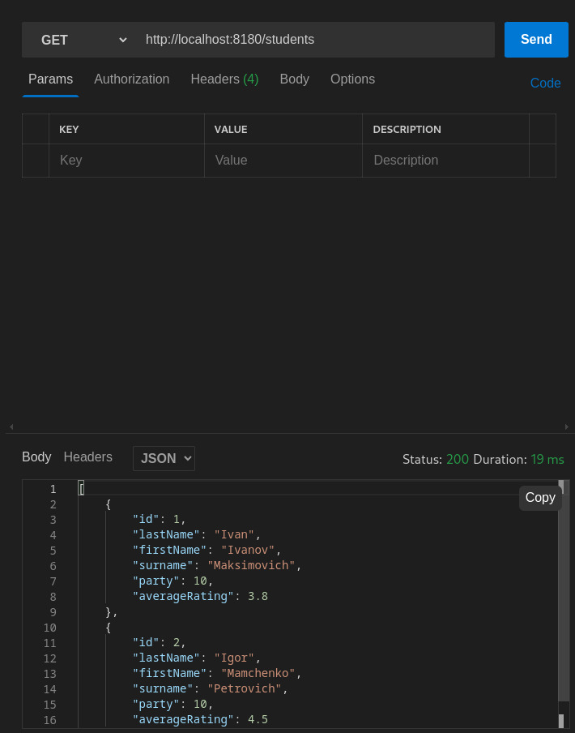
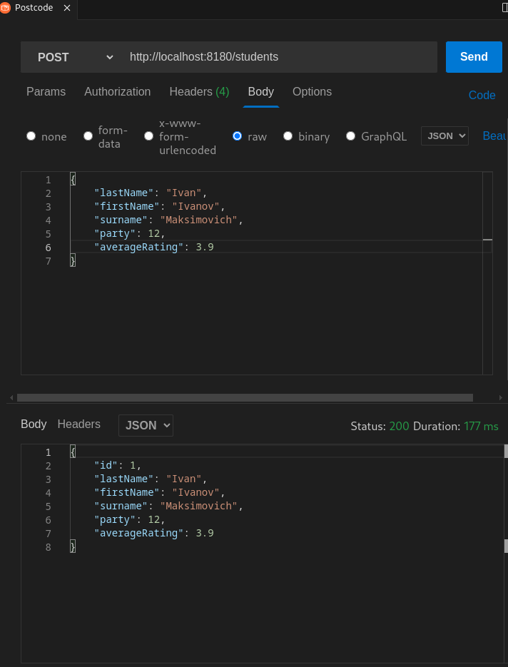
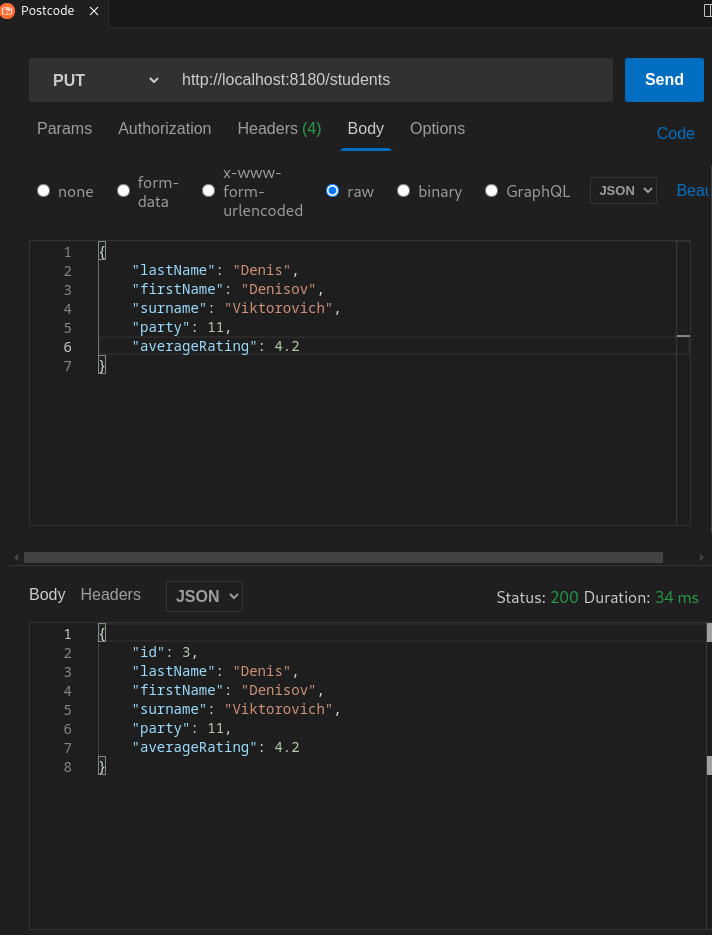
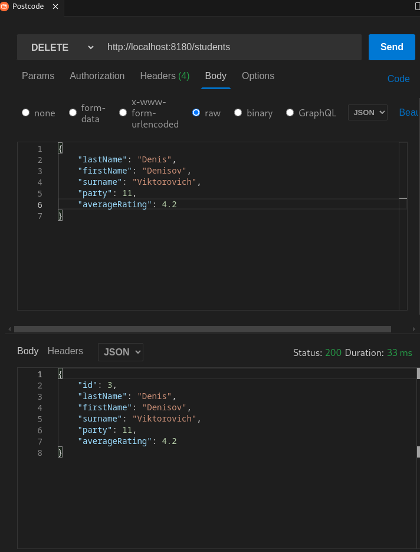
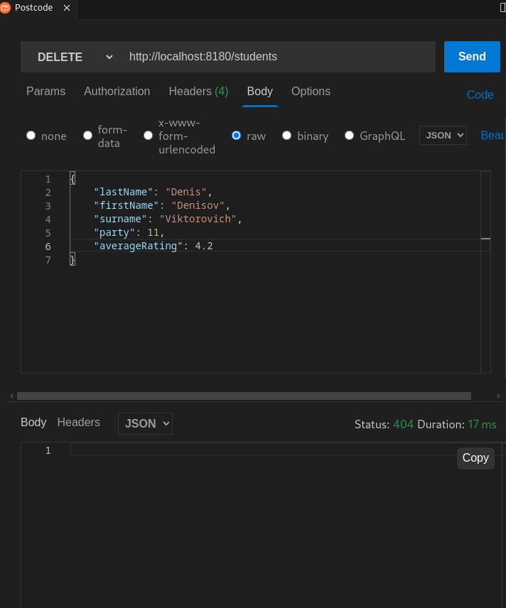

# spring_oath2

Для запуска приложения требуется maven, jdk 17  
и установленная база postgresql c созданной базой 'testdb'. 
Приложение запускается командой в терминале 
mvn spring-boot:run

 При входе в приложение на адрес http://localhost:8180  
 приложение попросит авторизоваться на github.
 
 При запуске с включённым профилем спринга nosecurity:
 

  
Повторное удаление возвращает 404 как и ожидалось.  
